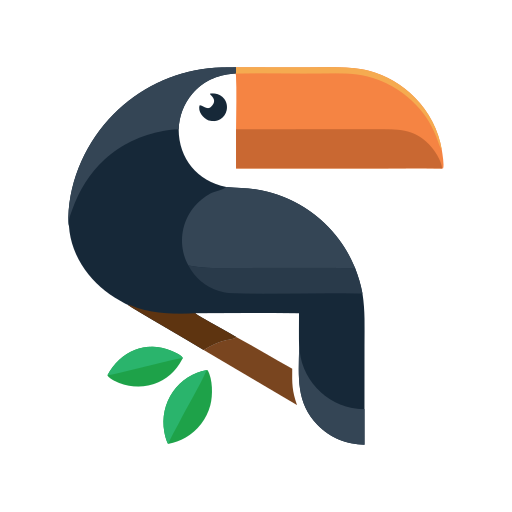

<div align="center">
  

# C.O.R.A

### **C**lassification des **O**iseaux par **R**econnaissance **A**coustique

[](https://opensource.org/licenses/MIT)
[](https://nextjs.org/)
[](https://www.prisma.io/)
[](https://www.docker.com/)

  <p align="center">
    <a href="#-à-propos">À propos</a> •
    <a href="#-installation">Installation</a> •
    <a href="#-stack-technique">Stack</a> •
    <a href="https://github.com/Link34500/C.O.R.A/issues">Signaler un bug</a>
  </p>
</div>

---

### 📖 À propos

**C.O.R.A** est un projet scolaire dédié à l'ornithologie numérique. L'objectif est de fournir une interface web capable d'analyser des flux audio pour identifier des espèces d'oiseaux grâce au Machine Learning.

> [!IMPORTANT]
> Le modèle de ML est actuellement en phase de développement avec une précision cible de **20% à 30%**.

---

### 🚀 Installation

<details>
<summary><b>Étape 1 : Prérequis (Cliquer pour dérouler)</b></summary>

- **Git** installé
- **Docker** & **Docker Compose** installés
- Un fichier `.env` configuré à la racine (Base de données, etc.)
</details>

**Étape 2 : Clonage & Lancement**

Lancement en mode développement :

```bash
# Cloner la branche dev
git clone -b dev [https://github.com/Link34500/C.O.R.A.git](https://github.com/Link34500/C.O.R.A.git)

# Accéder au dossier
cd C.O.R.A

# Lancer l'infrastructure (DB + Web)
docker compose up -d
```

Lancement en production :

```bash
# Cloner la branche master
git clone -b master [https://github.com/Link34500/C.O.R.A.git](https://github.com/Link34500/C.O.R.A.git)

# Accéder au dossier
cd C.O.R.A

# Lancer l'infrastructure (DB + Web)
docker compose up -d
```
